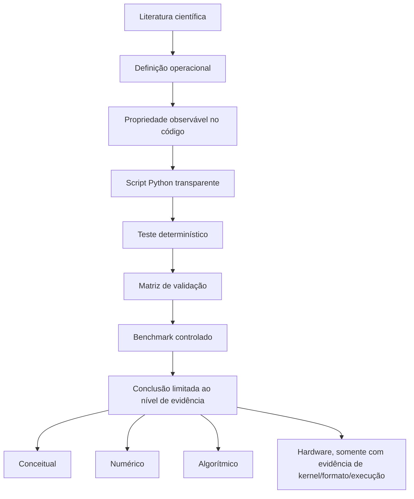

# Scientific Initiation - Validação de Operações de Transformers

Este repositório organiza a fase inicial de uma iniciação científica sobre
eficiência computacional em operações de Transformers sob quantização e pruning.

O objetivo atual **não** é afirmar ganho de hardware nem reproduzir uma
Transformer completa. O objetivo é mais básico e mais importante para a validade
do estudo: verificar se os conceitos, fórmulas, scripts Python e ferramentas que
serão usados nos benchmarks realmente correspondem ao que a literatura descreve.

Em outras palavras, antes de medir desempenho, este projeto valida se estamos
medindo a coisa certa.

## Estado Atual

- Validação conceitual, matemática e algorítmica implementada.
- Núcleo experimental classificado como **bloco Transformer simplificado**.
- Testes automatizados passando com warnings tratados como erro.
- Pruning e quantização classificados com limites explícitos de validade.
- Benchmarks amplos de desempenho ainda não foram usados como conclusão final.

Comando de validação atual:

```powershell
.\.venv\Scripts\python.exe -m pytest -q -W error
```

Resultado esperado:

```text
24 passed
```

## Escopo Científico

O plano de trabalho investiga operações centrais da arquitetura Transformer,
especialmente:

- projeções lineares densas;
- projeções `Q`, `K` e `V`;
- scaled dot-product attention;
- self-attention;
- multi-head attention;
- informação posicional;
- bloco Transformer simplificado;
- pruning;
- sparsity;
- quantização;
- latência;
- throughput;
- memória.

A formulação metodológica mais segura neste momento é:

> O estudo valida e simula trechos computacionalmente centrais de um bloco
> Transformer simplificado, derivados da arquitetura de Vaswani et al. (2017),
> para depois comparar o impacto de quantização e pruning em cenários
> controlados de inferência.

## O Que Este Repositório Valida

Este repositório valida propriedades observáveis, não apenas nomes de classes.
Cada conceito segue a lógica:

```text
referência científica
-> definição operacional
-> propriedade esperada no código
-> lógica implementada em Python
-> teste determinístico
-> limite da conclusão
```

Isso evita chamar qualquer rede neural de Transformer apenas porque o código tem
camadas lineares ou usa PyTorch.

## Fluxo Metodológico



## Bloco Transformer Simplificado

O núcleo experimental atual não é uma Transformer completa. Ele é um bloco
controlado com os componentes centrais necessários para estudar as operações do
recorte.

```mermaid
flowchart LR
    X["Entrada sequencial<br/>batch x seq_len x d_model"] --> P["Informação posicional"]
    P --> QKV["Projeções lineares<br/>Q, K, V"]
    QKV --> H["Separação em heads"]
    H --> A["Scaled dot-product attention<br/>softmax(QK^T / sqrt(d_k))V"]
    A --> C["Recombinação das heads"]
    C --> O["Projeção de saída"]
    O --> R1["Residual + LayerNorm"]
    R1 --> F["Feed-forward"]
    F --> R2["Residual + LayerNorm"]
    R2 --> Y["Saída sequencial"]
```



Critérios validados para o bloco:

- recebe entrada sequencial;
- preserva o formato sequencial na saída;
- possui projeções `Q`, `K` e `V`;
- calcula atenção compatível com `softmax(QK^T / sqrt(d_k))V`;
- usa multi-head attention;
- permite dependência entre posições;
- adiciona informação posicional;
- possui projeção de saída, residual, normalização e feed-forward;
- é determinístico em modo de avaliação;
- rejeita uma rede neural comum como controle negativo.

## O Que Não Está Sendo Afirmado

Este projeto ainda **não** afirma:

- que foi implementada uma Transformer completa;
- que pruning já gera ganho real de hardware;
- que quantização já acelera a execução em hardware;
- que os resultados reproduzem um modelo estado da arte;
- que uma técnica é superior antes dos benchmarks controlados.

Para chamar um resultado de hardware, será necessário mostrar evidência de
representação, formato, kernel ou caminho de execução compatível.

## Estrutura Do Repositório

```text
validacao/
  attention.py              # scaled dot-product attention e multi-head attention
  auditoria_transformer.py  # auditoria arquitetural do bloco
  benchmark_controlado.py   # runner experimental controlado
  classificacao.py          # classificação: não aderente, operação, bloco, Transformer
  dense.py                  # projeção linear densa
  flops.py                  # fórmulas analíticas de custo
  kv_cache.py               # equivalência com e sem KV cache
  metrics.py                # métricas de comparação contra baseline
  pesquisa.py               # perguntas de pesquisa e hipóteses
  protocolo.py              # schema obrigatório dos resultados
  quantization.py           # quantização simétrica int8
  sparsity.py               # observação de esparsidade
  transformer.py            # bloco Transformer simplificado

tests/
  test_validacao_conceitual.py
  test_benchmark_controlado.py

documentacao/
  base_teorica_validacao.md
  validacao_transformer.md
  matriz_validacao_ferramentas.md
  protocolo_experimental.md
  perguntas_pesquisa.md
  confronto_resultados_literatura.md
  explicacao_metodologia_validacao.md
  conceitos.txt

codigo/
  Código legado/protótipo anterior, preservado como histórico.
```

## Ambiente

O ambiente recomendado é um `.venv` local com Python 3.11.

Criação do ambiente no Windows:

```powershell
py -3.11 -m venv .venv
.\.venv\Scripts\python.exe -m pip install --upgrade pip
```

Instalação do PyTorch com CUDA 12.8, conforme o índice oficial do PyTorch:

```powershell
.\.venv\Scripts\python.exe -m pip install torch==2.11.0+cu128 torchvision==0.26.0+cu128 torchaudio==2.11.0+cu128 --index-url https://download.pytorch.org/whl/cu128
```

Instalação das dependências restantes:

```powershell
.\.venv\Scripts\python.exe -m pip install -r requirements-validacao.txt
```

Se CUDA não estiver disponível, os testes conceituais continuam podendo rodar em
CPU. Nesse caso, qualquer conclusão de hardware fica pendente.

## Como Rodar Os Testes

```powershell
.\.venv\Scripts\python.exe -m pytest -q -W error
```

O `-W error` transforma warnings em erro. Isso é proposital: se uma biblioteca
ou API mudar e começar a emitir warning relevante, o problema aparece antes de
virar resultado experimental.

## Como Rodar Um Benchmark Piloto

O benchmark controlado ainda deve ser tratado como etapa experimental, não como
conclusão final.

Exemplo pequeno:

```powershell
.\.venv\Scripts\python.exe -m validacao.benchmark_controlado --device cpu --warmup 1 --repetitions 3 --output resultados/benchmark_controlado.csv
```

Em GPU, se CUDA estiver disponível:

```powershell
.\.venv\Scripts\python.exe -m validacao.benchmark_controlado --device cuda --warmup 5 --repetitions 20 --output resultados/benchmark_controlado.csv
```

O benchmark registra:

- versão do PyTorch;
- versão CUDA;
- nome da GPU, quando disponível;
- dispositivo usado;
- configuração do bloco;
- cenário experimental;
- nível de validade;
- latência;
- throughput;
- memória;
- FLOPs teóricos;
- métricas de comparação contra baseline.

## Cenários Experimentais

| Cenário | Descrição | Nível inicial de validade |
| --- | --- | --- |
| `baseline` | Bloco sem pruning ou quantização. | Algorítmico |
| `pruning_magnitude` | Pruning por magnitude em camadas lineares. | Conceitual/algorítmico |
| `quantization_int8` | Quantização simétrica int8 manual, com dequantização para análise numérica. | Numérico |
| `torchao_int8` | Quantização int8 weight-only via torchao. | Numérico/algorítmico, hardware pendente |
| `pruning_plus_quantization` | Combinação exploratória de pruning e quantização manual. | Numérico/algorítmico |

## Validação De Ferramentas

Antes de usar uma ferramenta como evidência experimental, ela precisa estar na
matriz de validação. A matriz registra:

- ferramenta;
- conceito associado;
- fonte;
- teste aplicado;
- resultado observado;
- status;
- nível de validade.

Regra central:

> Uma técnica não é promovida para "hardware" apenas porque o nome dela sugere
> otimização. Ela só recebe esse nível se houver evidência de representação,
> formato, kernel ou caminho de execução compatível.

## Documentos Principais

- [Base teórica e validação](documentacao/base_teorica_validacao.md)
- [Validação arquitetural da Transformer](documentacao/validacao_transformer.md)
- [Matriz de validação de ferramentas](documentacao/matriz_validacao_ferramentas.md)
- [Protocolo experimental](documentacao/protocolo_experimental.md)
- [Perguntas de pesquisa](documentacao/perguntas_pesquisa.md)
- [Confronto com literatura](documentacao/confronto_resultados_literatura.md)
- [Explicação narrativa da metodologia](documentacao/explicacao_metodologia_validacao.md)
- [Resumo operacional dos conceitos](documentacao/conceitos.txt)

## Referências Base

- Goodfellow, Bengio e Courville. *Deep Learning*. <https://www.deeplearningbook.org/>
- Vaswani et al. *Attention Is All You Need*. <https://arxiv.org/abs/1706.03762>
- Tang et al. *A Survey on Transformer Compression*. <https://arxiv.org/abs/2402.05964>
- PyTorch scaled dot-product attention. <https://docs.pytorch.org/docs/stable/generated/torch.nn.functional.scaled_dot_product_attention.html>
- PyTorch pruning tutorial. <https://docs.pytorch.org/tutorials/intermediate/pruning_tutorial.html>
- torchao quantization. <https://docs.pytorch.org/ao/stable/api_ref_quantization.html>

## Resumo Da Posição Científica Atual

O repositório sustenta a seguinte afirmação:

> Os scripts atuais implementam e testam, de forma determinística, operações
> centrais de um bloco Transformer simplificado, permitindo avançar para
> benchmarks controlados de pruning e quantização com uma base conceitual
> rastreável.

E evita a afirmação:

> Foi demonstrado ganho real de hardware em uma Transformer completa.
