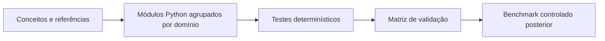
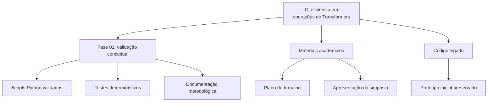

# Scientific Initiation

Repositório da iniciação científica sobre eficiência computacional em operações
de Transformers, com foco em validação metodológica, quantização, pruning e
benchmarks controlados.

Este repositório é da IC inteira. A fase ativa no momento é a validação
conceitual/metodológica dos scripts que serão usados antes dos benchmarks.

## Estrutura

```text
docs/
  plano_trabalho/
  apresentacoes/
    simposio_2026/

fases/
  01_validacao_conceitual/

legado/
  prototipo_inicial/
```

## Fase Ativa

A fase atual está em:

```text
fases/01_validacao_conceitual/
```

Ela valida se os conceitos e scripts Python usados no estudo correspondem ao que
a literatura descreve. O núcleo experimental atual deve ser chamado de **bloco
Transformer simplificado**, não de Transformer completa.

Documentação da fase:

- [README da validação](fases/01_validacao_conceitual/README.md)
- [Base teórica](fases/01_validacao_conceitual/docs/base_teorica_validacao.md)
- [Validação arquitetural](fases/01_validacao_conceitual/docs/validacao_transformer.md)
- [Matriz de ferramentas](fases/01_validacao_conceitual/docs/matriz_validacao_ferramentas.md)
- [Protocolo experimental](fases/01_validacao_conceitual/docs/protocolo_experimental.md)
- [Resumo operacional dos conceitos](fases/01_validacao_conceitual/docs/conceitos.txt)

## Como A Validação Está Organizada

A validação não foi estruturada como "um arquivo Python por conceito". Alguns
conceitos fazem parte da mesma operação técnica e, por isso, ficam juntos. Por
exemplo, scaled dot-product attention, self-attention e multi-head attention
ficam no módulo de atenção.

O fluxo usado na fase atual é:

```text
conceito científico
-> propriedade que deve aparecer no código
-> função/classe Python pequena e auditável
-> teste determinístico
-> evidência registrada na documentação
```



Em termos práticos:

- `fases/01_validacao_conceitual/docs/` explica os conceitos, referências e limites.
- `fases/01_validacao_conceitual/validacao/` implementa operações pequenas e rastreáveis.
- `fases/01_validacao_conceitual/tests/` importa essas operações e compara com fórmulas, valores esperados, NumPy, PyTorch, TensorFlow/Keras, scikit-learn ou checklists.

Essa organização serve para responder três perguntas importantes: o que a
literatura diz, como isso foi traduzido para código e como sabemos que o código
está aderente ao comportamento esperado.

## O Que Cada Arquivo Valida

A parte mais importante da fase atual está em:

```text
fases/01_validacao_conceitual/
  validacao/
  tests/
  docs/
  evidencias/
```

A pasta `validacao/` contém os scripts Python que implementam as operações. A
pasta `tests/` contém os testes que chamam esses scripts e conferem se o
comportamento observado bate com fórmulas, valores esperados ou bibliotecas de
referência.

Por isso, a leitura correta é: primeiro entendemos o conceito na documentação,
depois vemos a implementação pequena em Python, então usamos o teste para
verificar se aquilo se comporta como esperado.

| Arquivo | O que ele representa | O que é validado |
| --- | --- | --- |
| `validacao/attention.py` | Operações de atenção usadas em Transformers. | Valida scaled dot-product attention, self-attention, multi-head attention, divisão em cabeças, recombinação das cabeças e uso de máscara. A saída é comparada com cálculo manual/NumPy e com `torch.nn.functional.scaled_dot_product_attention`. |
| `validacao/comparacao_frameworks.py` | Validação cruzada do núcleo da atenção. | Compara os mesmos `Q`, `K`, `V` e máscara em NumPy manual, PyTorch manual, PyTorch SDPA e Keras SDPA com backend TensorFlow. |
| `validacao/transformer.py` | Um bloco Transformer simplificado. | Valida se o bloco tem entrada sequencial, projeções `Q`, `K`, `V`, atenção, projeção de saída, residual, normalização, FFN e informação posicional. Ele é classificado como bloco Transformer simplificado, não como Transformer completa. |
| `validacao/auditoria_transformer.py` | Auditoria para responder se a NN usada realmente pertence ao recorte Transformer. | Verifica componentes internos do bloco, testa dependência entre posições da sequência, compara a atenção interna com PyTorch e rejeita uma rede comum `Linear + ReLU + Linear` como controle negativo. |
| `validacao/dense.py` | Projeção linear densa. | Valida a operação `Y = XW^T + b`, que aparece nas projeções `Q`, `K`, `V`, na projeção de saída e na FFN. O teste compara a função com cálculo manual e NumPy. |
| `validacao/kv_cache.py` | Reaproveitamento de chaves e valores na inferência autoregressiva. | Valida se calcular token por token com cache produz resultado compatível com a atenção causal completa e se `K` e `V` anteriores são reaproveitados. |
| `validacao/sparsity.py` | Medição de esparsidade. | Conta quantos elementos são zero em um tensor e separa pruning conceitual de ganho real de hardware. Zerar pesos em matriz densa não é tratado automaticamente como ganho físico. |
| `validacao/quantization.py` | Quantização simétrica `int8`. | Verifica se os valores foram representados em `int8`, calcula escala, dequantização, erro numérico e bytes estimados. Isso valida representação numérica, não aceleração de hardware por si só. |
| `validacao/flops.py` | Custo computacional teórico. | Calcula FLOPs teóricos de projeções densas, atenção e FFN para permitir comparação controlada entre cenários. |
| `validacao/metrics.py` | Métricas para comparar saída do baseline com saída modificada. | Valida MSE, MAE, R2 e similaridade de cosseno com exemplos pequenos e comparação com `scikit-learn`. |
| `validacao/classificacao.py` | Regras de classificação conceitual. | Define se uma implementação é `nao_aderente`, `operacao_inspirada_em_transformer`, `bloco_transformer_simplificado` ou `transformer`. |
| `validacao/protocolo.py` | Schema obrigatório dos resultados. | Garante que CSVs futuros tenham todas as colunas necessárias: ambiente, configuração, método, métricas, validade e resultados. |
| `validacao/pesquisa.py` | Perguntas de pesquisa e hipóteses. | Registra RQs, hipóteses e métricas associadas para impedir que os benchmarks sejam interpretados sem critério científico. |
| `validacao/benchmark_controlado.py` | Runner de benchmark piloto. | Executa cenários pequenos e reprodutíveis, registra ambiente/seed, mede latência/throughput/memória quando possível e impede chamar algo de `hardware` sem evidência suficiente. |
| `validacao/analise_resultados.py` | Análise dos CSVs gerados. | Compara cenários contra baseline, calcula degradação numérica e organiza conclusões por nível de validade. |
| `validacao/benchmark_operacoes.py` | Runner das operações isoladas. | Executa projeção densa e self-attention com configurações versionadas, lotes independentes, hashes, manifesto e log. |
| `validacao/analise_benchmark_operacoes.py` | Análise entre execuções. | Valida checksums e reprodutibilidade, compara cada candidato com seu baseline e consolida média/desvio-padrão. |

Os testes principais ficam em cinco arquivos:

| Arquivo de teste | Função metodológica |
| --- | --- |
| `tests/test_validacao_conceitual.py` | Testa as definições matemáticas e conceituais: atenção, projeção densa, bloco Transformer simplificado, KV cache, pruning, sparsity, quantização, métricas e FLOPs. |
| `tests/test_benchmark_controlado.py` | Testa se o protocolo experimental está protegido: schema do CSV, ambiente, seed, cenários permitidos, perguntas de pesquisa e impedimento de conclusões de hardware sem evidência. |
| `tests/test_comparacao_frameworks.py` | Testa layouts, dependências e equivalência numérica entre NumPy, PyTorch e TensorFlow/Keras, além dos artefatos auditáveis. |
| `tests/test_benchmark_operacoes.py` | Testa configurações, portão da GPU, cenários, reprodutibilidade e persistência do runner principal. |
| `tests/test_analise_benchmark_operacoes.py` | Testa checksums, consolidação das execuções, relatório e gráficos. |

Em resumo: os arquivos em `validacao/` são as implementações auditáveis; os
arquivos em `tests/` são a prova determinística de que essas implementações
seguem o comportamento esperado dentro do recorte definido.

## Materiais Acadêmicos

O plano de trabalho fica em:

```text
docs/plano_trabalho/
```

Os materiais do simpósio de 2026 ficam reunidos em:

```text
docs/apresentacoes/simposio_2026/
```

Essa pasta contém os slides, previews, roteiro, guia de estudo, gráficos e o
script PowerShell usado para gerar a apresentação. Eles são materiais de
apresentação, não parte da fase de validação atual.

Índice da pasta:

- [Documentação geral](docs/README.md)
- [Materiais do simpósio 2026](docs/apresentacoes/simposio_2026/README.md)

## Código Legado

O protótipo inicial foi preservado em:

```text
legado/prototipo_inicial/
```

Ele não é usado como base da fase validada atual. Está mantido apenas como
histórico do desenvolvimento da IC.

## Rodar A Validação Atual

No Windows, usando o `.venv` do repositório:

```powershell
.\.venv\Scripts\python.exe -m pytest fases\01_validacao_conceitual\tests -q -W error
```

Resultado observado em 25/08/2026 após a infraestrutura de benchmark:

```text
45 passed, 1 skipped
```

O único teste ignorado exige CUDA; nenhum teste da comparação entre frameworks
foi ignorado. Consulte a [evidência numérica](fases/01_validacao_conceitual/evidencias/comparacao_frameworks/comparacao_atencao.md)
e o [smoke da pipeline](fases/01_validacao_conceitual/evidencias/benchmarks/smoke_cpu_2026-08-25/).

## Mapa Do Projeto



## Posição Científica Atual

O repositório sustenta esta afirmação:

> Os scripts atuais implementam e testam, de forma determinística, operações
> centrais de um bloco Transformer simplificado, permitindo avançar para
> benchmarks controlados de pruning e quantização com uma base conceitual
> rastreável.

O repositório ainda **não** afirma:

- implementação de uma Transformer completa;
- ganho real de hardware;
- superioridade de pruning ou quantização antes dos benchmarks controlados.
