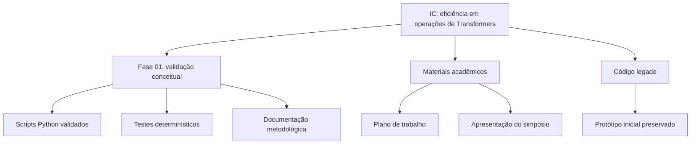

# Scientific Initiation

Repositório da iniciação científica sobre eficiência computacional em operações
de Transformers, com foco em validação metodológica, quantização, pruning e
benchmarks controlados.

Este repositório é da IC inteira. A fase ativa no momento é a validação
conceitual/metodológica dos scripts que serão usados antes dos benchmarks.

## Estrutura

```text
docs/
  plano_trabalho/
  apresentacoes/
    simposio_2026/

fases/
  01_validacao_conceitual/

legado/
  prototipo_inicial/
```

## Fase Ativa

A fase atual está em:

```text
fases/01_validacao_conceitual/
```

Ela valida se os conceitos e scripts Python usados no estudo correspondem ao que
a literatura descreve. O núcleo experimental atual deve ser chamado de **bloco
Transformer simplificado**, não de Transformer completa.

Documentação da fase:

- [README da validação](fases/01_validacao_conceitual/README.md)
- [Base teórica](fases/01_validacao_conceitual/docs/base_teorica_validacao.md)
- [Validação arquitetural](fases/01_validacao_conceitual/docs/validacao_transformer.md)
- [Matriz de ferramentas](fases/01_validacao_conceitual/docs/matriz_validacao_ferramentas.md)
- [Protocolo experimental](fases/01_validacao_conceitual/docs/protocolo_experimental.md)
- [Resumo operacional dos conceitos](fases/01_validacao_conceitual/docs/conceitos.txt)

## Materiais Acadêmicos

O plano de trabalho fica em:

```text
docs/plano_trabalho/
```

Os materiais do simpósio de 2026 ficam reunidos em:

```text
docs/apresentacoes/simposio_2026/
```

Essa pasta contém os slides, previews, roteiro, guia de estudo, gráficos e o
script PowerShell usado para gerar a apresentação. Eles são materiais de
apresentação, não parte da fase de validação atual.

Índice da pasta:

- [Documentação geral](docs/README.md)
- [Materiais do simpósio 2026](docs/apresentacoes/simposio_2026/README.md)

## Código Legado

O protótipo inicial foi preservado em:

```text
legado/prototipo_inicial/
```

Ele não é usado como base da fase validada atual. Está mantido apenas como
histórico do desenvolvimento da IC.

## Rodar A Validação Atual

No Windows, usando o `.venv` do repositório:

```powershell
.\.venv\Scripts\python.exe -m pytest fases\01_validacao_conceitual\tests -q -W error
```

Resultado esperado:

```text
24 passed
```

## Mapa Do Projeto



## Posição Científica Atual

O repositório sustenta esta afirmação:

> Os scripts atuais implementam e testam, de forma determinística, operações
> centrais de um bloco Transformer simplificado, permitindo avançar para
> benchmarks controlados de pruning e quantização com uma base conceitual
> rastreável.

O repositório ainda **não** afirma:

- implementação de uma Transformer completa;
- ganho real de hardware;
- superioridade de pruning ou quantização antes dos benchmarks controlados.
