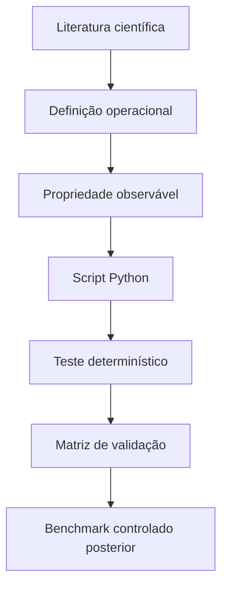
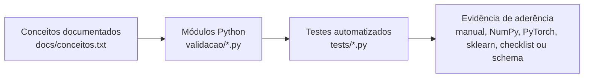

# Fase 01 - Validação Conceitual

Esta fase valida os conceitos, fórmulas, scripts Python e ferramentas que serão
usados nos benchmarks da IC.

O objetivo é verificar se estamos medindo a coisa certa antes de medir
desempenho.

## O Que Está Validado

- projeção linear densa;
- projeções `Q`, `K` e `V`;
- scaled dot-product attention;
- self-attention;
- multi-head attention;
- informação posicional;
- bloco Transformer simplificado;
- inferência determinística;
- KV cache;
- pruning;
- sparsity;
- quantização;
- latência;
- throughput;
- memória;
- schema de benchmark controlado.

O núcleo experimental atual é um **bloco Transformer simplificado**. Ele pertence
à família Transformer no recorte estudado, mas não deve ser chamado de
Transformer completa.

## Metodologia

Cada conceito segue a lógica:

```text
referência científica
-> definição operacional
-> propriedade esperada no código
-> lógica implementada em Python
-> teste determinístico
-> limite da conclusão
```



## Como Conceitos, Código E Testes Se Relacionam

Os conceitos documentados não têm uma relação 1 para 1 com arquivos `.py`.
Alguns conceitos pertencem ao mesmo domínio técnico e, por isso, ficam no mesmo
módulo. Por exemplo, scaled dot-product attention, self-attention e multi-head
attention ficam juntos porque todos fazem parte da lógica de atenção.

Por conta disso, a pasta `validacao/` tem menos arquivos do que a lista de
conceitos validados. Isso é esperado: os arquivos representam domínios técnicos,
não capítulos isolados.

A relação correta é:

```text
docs/conceitos.txt
  define os conceitos, propriedades esperadas e limites da conclusão

validacao/*.py
  implementa funções e classes pequenas, agrupadas por domínio técnico

tests/*.py
  importa essas funções/classes e compara com referências ou valores esperados
```



### Mapa Código-Teste

| Módulo Python | Conceitos cobertos | Como é validado |
| --- | --- | --- |
| `attention.py` | scaled dot-product attention, self-attention, multi-head attention, split/combine heads e máscara aditiva | Compara casos pequenos com valor esperado, NumPy independente e `torch.nn.functional.scaled_dot_product_attention`. |
| `transformer.py` | bloco Transformer simplificado, Q/K/V, informação posicional, residual, normalização e FFN | Instancia o bloco, verifica componentes, preservação de shape e classificação como bloco simplificado. |
| `auditoria_transformer.py` | auditoria arquitetural da NN, dependência entre posições, determinismo e controle negativo | Abre o bloco, extrai Q/K/V, compara attention interna com PyTorch e rejeita uma NN comum `Linear + ReLU + Linear`. |
| `dense.py` | projeção linear densa | Compara `Y = XW^T + b` com cálculo manual e NumPy. |
| `kv_cache.py` | KV cache e atenção causal com/sem cache | Compara saída com cache contra saída causal completa e mede reaproveitamento de K/V. |
| `sparsity.py` | sparsity e observação de zeros | Conta zeros em tensores pequenos e classifica o nível de validade. |
| `quantization.py` | quantização simétrica int8, armazenamento e erro numérico | Verifica dtype `int8`, bytes por elemento e erro após dequantização. |
| `flops.py` | custo teórico de projeções, attention e FFN | Compara fórmulas analíticas com casos pequenos conhecidos. |
| `metrics.py` | MSE, MAE, R2 e similaridade de cosseno usadas na análise posterior | Compara implementações manuais com valores conhecidos e `scikit-learn`. |
| `protocolo.py` | schema obrigatório dos resultados | Valida colunas e campos obrigatórios do CSV de benchmark. |
| `pesquisa.py` | perguntas de pesquisa e hipóteses | Verifica se perguntas, métricas e hipóteses estão registradas. |
| `benchmark_controlado.py` | baseline, pruning, quantização, latência, throughput, memória e nível de validade | Executa uma grade pequena, registra ambiente/seed e impede promoção indevida para `hardware`. |
| `analise_resultados.py` | análise posterior dos CSVs | Compara cenários com baseline, gera tabelas e conclusões classificadas por validade. |
| `classificacao.py` | rótulos de aderência à família Transformer | Classifica como `nao_aderente`, `operacao_inspirada_em_transformer`, `bloco_transformer_simplificado` ou `transformer`. |

Assim, a pergunta "quantos conceitos existem?" é respondida pelos documentos; a
pergunta "onde isso está implementado?" é respondida pelos módulos; e a pergunta
"como sei que funciona?" é respondida pelos testes.

## Estrutura Da Fase

```text
fases/01_validacao_conceitual/
  README.md
  requirements.txt
  validacao/
  tests/
  docs/
```

- `validacao/`: scripts Python transparentes e pequenos.
- `tests/`: testes conceituais, matemáticos e de protocolo.
- `docs/`: documentos metodológicos e matriz de validação.

## Ambiente

Criar o ambiente na raiz do repositório:

```powershell
py -3.11 -m venv .venv
.\.venv\Scripts\python.exe -m pip install --upgrade pip
```

Instalar PyTorch com CUDA 12.8:

```powershell
.\.venv\Scripts\python.exe -m pip install torch==2.11.0+cu128 torchvision==0.26.0+cu128 torchaudio==2.11.0+cu128 --index-url https://download.pytorch.org/whl/cu128
```

Instalar dependências da fase:

```powershell
.\.venv\Scripts\python.exe -m pip install -r fases\01_validacao_conceitual\requirements.txt
```

Se CUDA não estiver disponível, os testes conceituais podem rodar em CPU. Nesse
caso, conclusões de hardware ficam pendentes.

## Testes

Rodar da raiz do repositório:

```powershell
.\.venv\Scripts\python.exe -m pytest fases\01_validacao_conceitual\tests -q -W error
```

Resultado esperado:

```text
24 passed
```

## Benchmark Piloto

O benchmark ainda é etapa experimental. Ele não deve ser usado sozinho para
afirmar ganho real de hardware.

Exemplo em CPU:

```powershell
$env:PYTHONPATH = "fases\01_validacao_conceitual"
.\.venv\Scripts\python.exe -m validacao.benchmark_controlado --device cpu --warmup 1 --repetitions 3 --output resultados\benchmark_controlado.csv
```

## O Que Ainda Não Está Afirmado

Esta fase ainda não afirma:

- que foi implementada uma Transformer completa;
- que pruning gera ganho real de hardware;
- que quantização acelera a execução em hardware;
- que alguma técnica é superior antes dos benchmarks controlados.

Para chamar um resultado de hardware, será necessário mostrar evidência de
representação, formato, kernel ou caminho de execução compatível.

## Documentos Principais

- [Base teórica e validação](docs/base_teorica_validacao.md)
- [Validação arquitetural da Transformer](docs/validacao_transformer.md)
- [Matriz de validação de ferramentas](docs/matriz_validacao_ferramentas.md)
- [Protocolo experimental](docs/protocolo_experimental.md)
- [Perguntas de pesquisa](docs/perguntas_pesquisa.md)
- [Confronto com literatura](docs/confronto_resultados_literatura.md)
- [Explicação narrativa da metodologia](docs/explicacao_metodologia_validacao.md)
- [Resumo operacional dos conceitos](docs/conceitos.txt)
