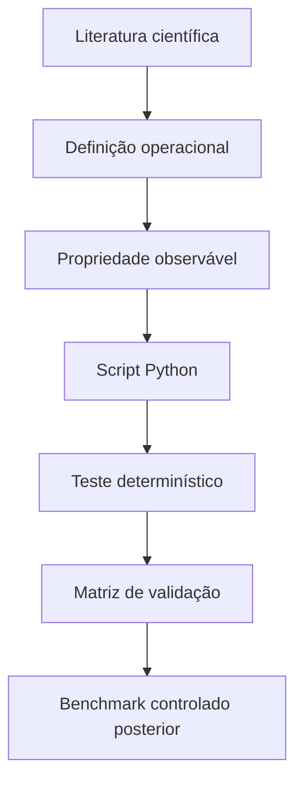

# Fase 01 - Validação Conceitual

Esta fase valida os conceitos, fórmulas, scripts Python e ferramentas que serão
usados nos benchmarks da IC.

O objetivo é verificar se estamos medindo a coisa certa antes de medir
desempenho.

## O Que Está Validado

- projeção linear densa;
- projeções `Q`, `K` e `V`;
- scaled dot-product attention;
- self-attention;
- multi-head attention;
- informação posicional;
- bloco Transformer simplificado;
- inferência determinística;
- KV cache;
- pruning;
- sparsity;
- quantização;
- latência;
- throughput;
- memória;
- schema de benchmark controlado.

O núcleo experimental atual é um **bloco Transformer simplificado**. Ele pertence
à família Transformer no recorte estudado, mas não deve ser chamado de
Transformer completa.

## Metodologia

Cada conceito segue a lógica:

```text
referência científica
-> definição operacional
-> propriedade esperada no código
-> lógica implementada em Python
-> teste determinístico
-> limite da conclusão
```



## Estrutura Da Fase

```text
fases/01_validacao_conceitual/
  README.md
  requirements.txt
  validacao/
  tests/
  docs/
```

- `validacao/`: scripts Python transparentes e pequenos.
- `tests/`: testes conceituais, matemáticos e de protocolo.
- `docs/`: documentos metodológicos e matriz de validação.

## Ambiente

Criar o ambiente na raiz do repositório:

```powershell
py -3.11 -m venv .venv
.\.venv\Scripts\python.exe -m pip install --upgrade pip
```

Instalar PyTorch com CUDA 12.8:

```powershell
.\.venv\Scripts\python.exe -m pip install torch==2.11.0+cu128 torchvision==0.26.0+cu128 torchaudio==2.11.0+cu128 --index-url https://download.pytorch.org/whl/cu128
```

Instalar dependências da fase:

```powershell
.\.venv\Scripts\python.exe -m pip install -r fases\01_validacao_conceitual\requirements.txt
```

Se CUDA não estiver disponível, os testes conceituais podem rodar em CPU. Nesse
caso, conclusões de hardware ficam pendentes.

## Testes

Rodar da raiz do repositório:

```powershell
.\.venv\Scripts\python.exe -m pytest fases\01_validacao_conceitual\tests -q -W error
```

Resultado esperado:

```text
24 passed
```

## Benchmark Piloto

O benchmark ainda é etapa experimental. Ele não deve ser usado sozinho para
afirmar ganho real de hardware.

Exemplo em CPU:

```powershell
$env:PYTHONPATH = "fases\01_validacao_conceitual"
.\.venv\Scripts\python.exe -m validacao.benchmark_controlado --device cpu --warmup 1 --repetitions 3 --output resultados\benchmark_controlado.csv
```

## O Que Ainda Não Está Afirmado

Esta fase ainda não afirma:

- que foi implementada uma Transformer completa;
- que pruning gera ganho real de hardware;
- que quantização acelera a execução em hardware;
- que alguma técnica é superior antes dos benchmarks controlados.

Para chamar um resultado de hardware, será necessário mostrar evidência de
representação, formato, kernel ou caminho de execução compatível.

## Documentos Principais

- [Base teórica e validação](docs/base_teorica_validacao.md)
- [Validação arquitetural da Transformer](docs/validacao_transformer.md)
- [Matriz de validação de ferramentas](docs/matriz_validacao_ferramentas.md)
- [Protocolo experimental](docs/protocolo_experimental.md)
- [Perguntas de pesquisa](docs/perguntas_pesquisa.md)
- [Confronto com literatura](docs/confronto_resultados_literatura.md)
- [Explicação narrativa da metodologia](docs/explicacao_metodologia_validacao.md)
- [Resumo operacional dos conceitos](docs/conceitos.txt)
